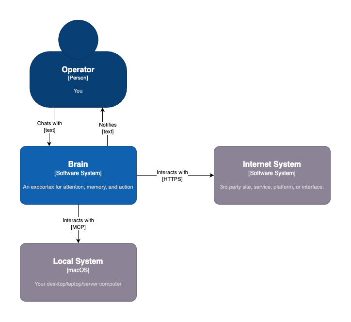
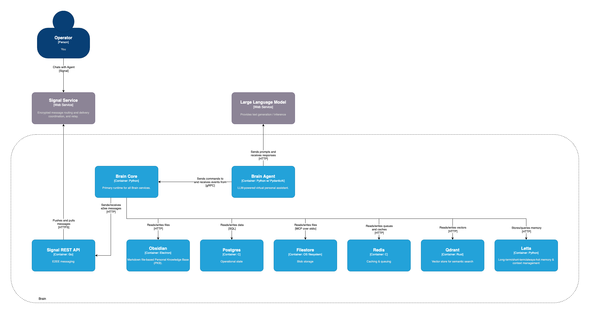
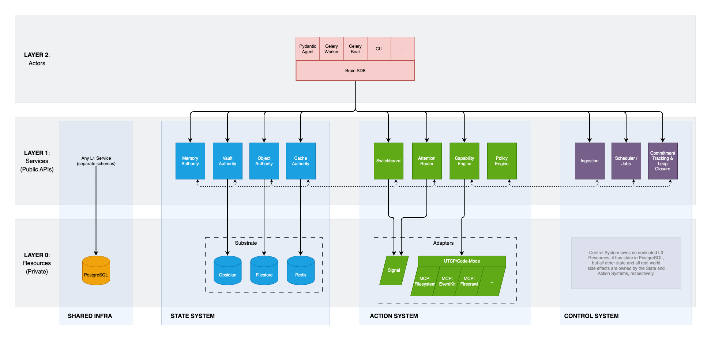

# Brain
An exocortex for attention, memory, and action.

Brain is a local-first AI system grounded in data sovereignty and durable
knowledge; cognitive infrastructure that prioritizes context, directs intent
deliberately, and closes loops.

## Overview
_Conceptually_, Brain has three parts:
1. A **personal knowledge base**: durable, human-readable, locally-stored
   information. At its simplest, this could be a single (if very large) file.
2. A **reasoning engine**: an LLM used to interpret context, propose actions,
   explain decisions, and interact with you conversationally.
3. A **capabilities**: governed operations that interact with the real world
   (files, calendars, messaging, etc.) via native APIs or MCP Servers.

The **Agent** serves to coordinate these concerns while keeping them separate,
inspectable, and under your control.

_Architecturally_, the system takes advantage of Docker to isolate subsystems.
In an ideal world every component would be containerized, but for various
reasons (security boundaries, usability, performance) there are a limited number
of services that need to run directly on your host system:
- Obsidian, with its various plugins &mdash; _required_
- Ollama for local chat and embedding &mdash; _optional_
- Any MCP Servers which require host access (e.g. for EventKit on MacOS) &mdash;
  _optional_
- The Host MCP Gateway proxy (an HTTP server) &mdash; _optional_

All other services are run with Docker Compose:
- Durable working state and application logs are kept in **Postgres**
- Caching and queueing are handled by **Redis**
- Semantic search for embeddings is powered by **Qdrant**
- Memory (short- and long-term) is managed by **Letta**
- Secure chat/messaging is run through **Signal**
- And the Agent process itself, built with **Pydantic AI**, leverages 
  - **LiteLLM** for model orchestration
  - **UTCP Code-Mode** for MCP tool discovery/execution

There is an optional OpenTelemetry-based observability stack (a separate but
related Docker Compose) which leverages **Prometheus**, **Loki**, and
**Grafana**.

## Architecture
If you aren't familiar with the [C4 Model](https://c4model.com), I'd highly
recommend it. It's a 30-minute video that will instantly make your diagrams
simple, readable, durable, and useful.

### C4 System Context Diagram
It's just you, your agent, and your local system ...and whatever parts of the
Internet you choose to aim it at.

### C4 Container Diagram
"That's a lot of processes!" Yeah... I know.

### System Responsibilities & Boundaries
Responsibilities & Boundaries are one of the most useful ways to think about the
system architecture... just remember, this is conceptual - it's not a
deployment, netowrk, or data flow diagram.

## Data Protection
What needs to be backed up, and why?

**High Priority —** Authoritative Information
- Custom configuration & policy files under `~/.config/brain`
- Obsidian vault (canonical knowledge, notes, promoted memory)
- Postgres (operational state - scheduels, logs, etc.)
- Local object store `root_dir` (raw artifacts)

**Medium Priority —** Durable System State
- Signal CLI state (device + message metadata)

**Low Priority —** Derived / Cache
- Qdrant embeddings and indexes
- TODO: Add Redis

## Phased Implementation
### ✅ DONE Phase 1: Text interaction + memory + MCP tools
- Obsidian Local REST API integration (read/write)
- Letta archival memory
- Code-Mode (UTCP) for MCP tool calls
- Signal messaging with allowlisted senders
- Vault indexer + Qdrant semantic search
- Optional observability stack (OTel)

### ✅ DONE Phase 2: The "Assitant Triangle"
- Skill framework + capability registry
- Attention router + interruption policy
- Commitment tracking + loop closure
- Requires scheduled/background jobs, policy engine, ingestion pipeline~~

### ⚠️ Phase 3: Refactor to respect (in work)
- Define clean subsystem boundaries & responsibilities
- Refactor codebase along clean boundaries with crisp public APIs
- Extensive testing for enforcement of new semantics

### Phase 3: Voice + telephony + SMS (unstarted)
- Local voice (whisper.cpp + Piper, openWakeWord)
- POTS phone support (Twilio Media Streams)
- SMS fallback (Google Voice)
