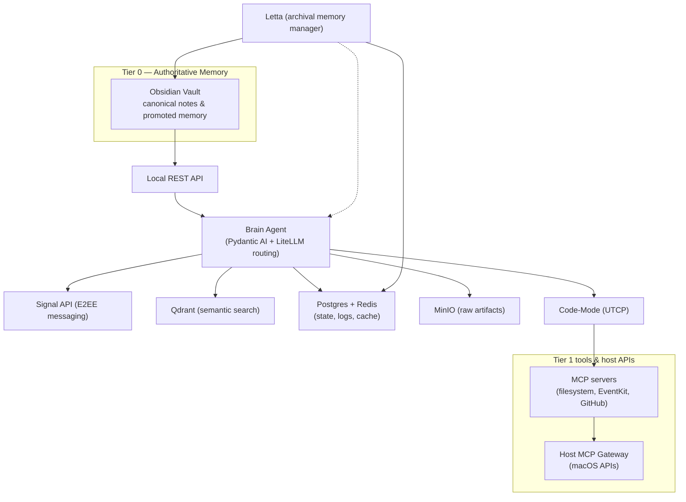

<!-- Yes, inline HTML in a README. Gross. Sue me, I didn't want a huge image because it's not that interesting. -->
<table>
  <tr>
    <h1>Brain</h1>
  </tr>
  <tr>
    <td>
      
    </td>
    <td>
      
      
      
    </td>
  </tr>
</table>

An exocortex for attention, memory, and action. Brain is a local-first AI system grounded in data sovereignty and
durable knowledge; "cognitive infrastructure" that prioritizes context, directs intent deliberately, and closes loops.

## Overview
_Conceptually_, Brain has three parts:
1. A **personal knowledge base**: durable, human-readable, locally-stored information. At its simplest, this could be a
   single (if very large) file.
2. A **reasoning engine**: an LLM used to interpret context, propose actions, explain decisions, and interact with you
   conversationally.
3. A **capability layer**: governed operations that interact with the real world (files, calendars, messaging, etc.) via
   native APIs or MCP Servers.

The **Agent** serves to coordinate these concerns while keeping them separate, inspectable, and under your control.

_Architecturally_, the system takes advantage of Docker to isolate subsystems. In an ideal world every component would
be containerized, but for various reasons (security boundaries, usability, performance) there are a limited number of
services that need to run directly on your host system:
- Obsidian, with its various plugins &mdash; _required_
- Ollama for local chat and embedding &mdash; _optional_
- Any MCP Servers which require host access (e.g. for EventKit on MacOS) &mdash; _optional_
- The Host MCP Gateway proxy (an HTTP server) &mdash; _optional_

All other services are run with Docker Compose:
- Durable working state and application logs are kept in **Postgres**
- Object storage is provided by **MinIO**
- Caching and queueing are handled by **Redis**
- Semantic search for embeddings is powered by **Qdrant**
- Memory (short- and long-term) is managed by **Letta**
- Secure chat/messaging is run through **Signal**
- And the Agent process itself, built with **Pydantic AI**, leverages 
  - **LiteLLM** for model orchestration
  - **UTCP Code-Mode** for MCP tool discovery/execution

There is an optional OpenTelemetry-based observability stack (a separate but related Docker Compose) which leverages
**Prometheus**, **Loki**, and **Grafana**.

## Architecture

## Data Tiers (Current State)
**Tier 0 — Authoritative Information**
- Obsidian vault (canonical notes, promoted memory)
- TODO: Add MinIO
- Configuration/policy files under `~/.config/brain`

**Tier 1 — Durable System State**
- Postgres (action logs, operational state)
- Letta internal DB (archival memory state)
- Signal CLI state (device + message metadata)

**Tier 2 — Derived / Cache**
- Qdrant embeddings and indexes
- Summaries and derived artifacts
- TODO: Add Redis

## Phased Implementation
### Phase 1: Text interaction + memory + MCP tools (implmented)
- Obsidian Local REST API integration (read/write)
- Letta archival memory
- Code-Mode (UTCP) for MCP tool calls
- Signal messaging with allowlisted senders
- Vault indexer + Qdrant semantic search
- Optional observability stack (OTel)

### Phase 2: The "Assitant Triangle" (in work)
- Skill framework + capability registry
- Attention router + interruption policy
- Commitment tracking + loop closure
- Requires: scheduled/background jobs, policy engine, etc

### Phase 3: Voice + telephony + SMS (planned)
- Local voice (whisper.cpp + Piper, openWakeWord)
- POTS phone support (Twilio Media Streams)
- SMS fallback (Google Voice)

