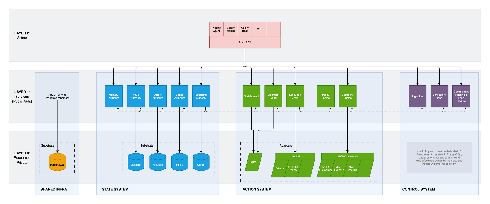

# Brain
An exocortex for attention, memory, and action. This is a local-first AI system
grounded in data sovereignty and durable knowledge; cognitive infrastructure
that prioritizes context, directs intent deliberately, and closes loops.

_**NOTE:** This project is in active/experimental development and extremely
unstable. Don't @ me, bro. When it gets a non-Cthullian version number, you'll
know it's safe(r) to use._

------------------------------------------------------------------------
## Motivation
I wanted a Siri that didn't suck; an actual Jarvis; an assistant with access to
my files, calendar, messages, meeting transcripts, and the web, with the
capability to answer questions, surface reminders when pertinent, and
continuously learn from all of it.

My original desire was simply for a system to help organize information and keep
track of things, and you can see this initial idea fulfilled in the Ingestion
and Commitment Services. I wound up with something much more "General Purpose"
by accident, in the course of designing something robust and flexible enough to
sanely handle that original scope well.

On January 1st, 2026, I decided to start an experiment, bolting [PydanticAI]
onto [Obsidian] and piping it through [Signal]. What exists now is a maturation
& formalization of that initial prototype, redesigned from the ground up with
crisp boundaries to ensure:
- data sovereignty
- security & governance
- extensibility

Shortly after that, Anthropic released [Claude Cowork] and then the [OpenClaw]
thin happened. If you want a direct comparison, Brain is:
- Not vendor-locked.
- Privacy-, security-, and local-first.
- Constrained by design: every real-world consequence the system can effect must
  be A) explicitly allowed B) compliant with your preferred policies and C)
  fully auditable.

------------------------------------------------------------------------
## Overview
_Conceptually_, Brain has three primary domains:
1. A **personal knowledge base**: durable, human-readable, locally-stored
   information. At its simplest, this could be a single (if very large) file.
2. A **reasoning engine**: an LLM used to interpret context, propose actions,
   explain decisions, and interact with you conversationally.
3. **Capabilities**: governed operations that interact with the real world
   (files, calendars, messaging, etc.) via native APIs or MCP Servers.

_Operationally_, the system takes advantage of Docker for process isolation. In
an ideal world every process would be containerized, but for various reasons
(security, usability, performance) there are a limited number of services that
need to run directly on your host system:
- [Obsidian] with the [Local REST API] plugin &mdash; _required_
- [Ollama] &mdash; _recommended_ for embedding, _optional_ for inference
- The **Host MCP Gateway** server (an HTTP proxy) &mdash; _required assuming you
  want MCP Servers with host-level access (e.g. EventKit on macOS)_

All other services are run with Docker Compose:
- Brain Agent, built with [PydanticAI]
- Brain Core, which houses all runtime _State_, _Action_, and _Control_ services
- Secure messaging thanks to [Signal]
- Durable working state and application logs are kept in [Postgres]
- Caching and queueing are handled by [Redis]
- Vector search for semantic embeddings is powered by [Qdrant]
- Memory (short- and long-term) is managed by [Letta]

There is also an optional OpenTelemetry-based observability stack (a separate
but related Docker Compose) which leverages [Prometheus], [Loki],
[Grafana], and [cAdvisor].

------------------------------------------------------------------------
## Architecture
The most useful way to understand the system structure is the Boundaries &
Responsibilities diagram — a conceptual map of _Layers_, _Systems_, _Services_,
and _Resources_. It is not a deployment or data flow diagram.

See the full [Boundaries &
Responsibilities](docs/boundaries-and-responsibilities.md) document for details.

------------------------------------------------------------------------
## Documentation
Recommended reading order:
1. **[Manifesto](docs/manifesto.md)** &mdash; Design philosophy, first
   principles, and architectural invariants.
2. **[Boundaries & Responsibilities](docs/boundaries-and-responsibilities.md)**
   &mdash; Layer model, system model, service catalog, and shared
   infrastructure.
3. **[Conventions](docs/conventions.md)** &mdash; APIs, envelopes, principals,
   error taxonomy, SDKs, policy enforcement, and Pydantic contract rules.
4. **[Component Design](docs/component-design.md)** &mdash; Component
   registration, manifests, and implementation patterns.
5. **[Project Layout](docs/project-layout.md)** &mdash; Directory structure
   mapped to the conceptual model.
6. **[Development Guide](docs/development-guide.md)** &mdash; Setup, make
   targets, testing, and contributor workflows.
7. **[Configuration Reference](docs/configuration.md)** &mdash; Config file
   schema, environment variable overrides, and per-section key reference.
8. **[Glossary](docs/glossary.md)** &mdash; Term definitions (generated from
   YAML).
9. **[Service API Reference](docs/service-api.md)** &mdash; Public API surface
   (generated from code).
10. **[Roadmap](docs/roadmap.md)** &mdash; Phased implementation plan and
    current status.

------------------------------------------------------------------------
## Getting Started
See the [Development Guide](docs/development-guide.md) for prerequisites,
environment setup, and how to build/test.

[cAdvisor]: https://github.com/google/cadvisor
[Local REST API]: https://github.com/coddingtonbear/obsidian-local-rest-api
[Claude Cowork]: https://claude.com/product/cowork
[Grafana]: https://grafana.com
[Letta]: https://www.letta.com
[Loki]: https://grafana.com/oss/loki/
[Obsidian]: https://obsidian.md
[Ollama]: https://ollama.com
[OpenClaw]: https://github.com/openclaw/openclaw
[Postgres]: https://www.postgresql.org
[Prometheus]: https://prometheus.io
[PydanticAI]: https://ai.pydantic.dev
[Qdrant]: https://qdrant.tech
[Redis]: https://redis.io
[Signal]: https://signal.org

------------------------------------------------------------------------
_End of README_ 
