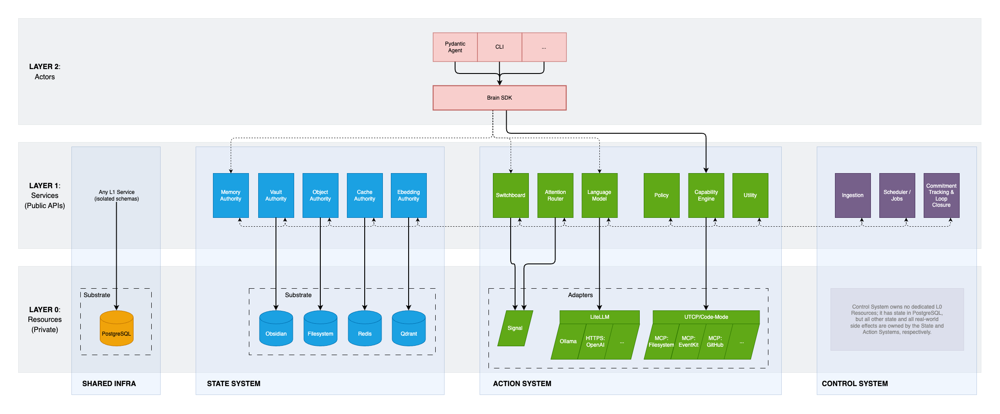

# Brain
An exocortex for attention, memory, and action. This is a local-first AI system
grounded in data sovereignty and durable knowledge; cognitive infrastructure
that prioritizes context, directs intent deliberately, and closes loops.

***NOTE:** This project is in active/experimental development and extremely
unstable. Don't @ me, bro. When it gets a non-Cthullian version number, you'll
know it's safe(r) to use.*

------------------------------------------------------------------------
## Motivation
I wanted a Siri that didn't suck; a real Jarvis. A local-first,
privacy respecting, security forward, Personal Virtual Assistant (PVA).

My initial use case was to manage commitments: to look across
messages, email, meetings, and calendars, and not just build up a todo list, but
to actually capture the essence, impact, effort, and timeline of obligations and
then support and facilitate timely action towards them. Think:

> Hey boss, I know we have that project meeting next Thursday but I don't think
> we've prepped yet - tomorrow looks pretty open so I've put a 90 minute focus
> block on the calendar for that.

January 1st, 2026, I decided to start an experiment, bolting [PydanticAI] on top
of [Obsidian] and piping communication through [Signal]. What exists now is a
maturation & formalization of that initial prototype, redesigned from the ground
up with crisp boundaries to ensure:
* extensibility
* observability
* transparency
* governance

------------------------------------------------------------------------
## Overview
*Conceptually*, Brain has three primary domains:
1. A **personal knowledge base**: durable, human-readable, locally-stored
   information. At its simplest, this could be a single (if very large) file.
2. A **reasoning engine**: an LLM used to interpret context, propose actions,
   explain decisions, and interact with you conversationally.
3. **Ops**: governed functions that interact with the real world (files,
   calendars, messaging, etc.) via native APIs or MCP Servers.

*Operationally*, the system takes advantage of Docker for process isolation. In
an ideal world every process would be containerized, but for various reasons
(security, usability, performance) there are a limited number of services that
need to run directly on your host system:
* [Obsidian] with the [Local REST API] plugin &mdash; *required*
* [Ollama] &mdash; *recommended* for embedding, *optional* for inference want
  MCP Servers with host-level access (e.g. EventKit on macOS)*

All other services are run with Docker Compose:
* Brain Assistant, built with [PydanticAI]
* Brain Core, which houses all runtime *State*, *Effect*, and *Reason*
  Components
* Brain Worker and Subagent, for async/parallel work
* Brain MCP Adapter sidecar, connecting to configured MCP servers
* Secure messaging thanks to [Signal]
* Durable working state and application logs are kept in [Postgres]
* Caching and queueing are handled by [Valkey]
* Vector search for semantic embeddings is powered by [Qdrant]
* Object blobs are stored in [SeaweedFS]

Host port assignments (non-standard range to avoid conflicts):

| Port | Service          | Protocol |
|------|------------------|----------|
| 8760 | Postgres         | TCP      |
| 8761 | Valkey           | TCP      |
| 8762 | Qdrant           | HTTP     |
| 8333 | SeaweedFS S3 API | HTTP     |
| 8898 | Brain Core       | HTTP     |

There is also an optional OpenTelemetry-based observability stack in
`docker-compose.observability.yaml`. It routes Brain traces through an OTel
Collector to self-hosted [Langfuse], backed by [ClickHouse] and the existing
[Postgres], [Valkey], and [SeaweedFS] services. See
[Observability](docs/observability.md) for connection details, required secrets,
environment variables, and startup checks.

------------------------------------------------------------------------
## Architecture
The most useful way to understand the system structure is the Boundaries &
Responsibilities diagram — a conceptual map of _Tiers_, _Systems_, _Actors_,
_Services_, and _Resources_. It is not a deployment or data flow diagram and it
does not describe the full scope of the project, but it does a good job at
visualizing how I think about control flow, cohesion, and decoupling.

See the full [Boundaries &
Responsibilities](docs/boundaries-and-responsibilities.md) document for details.

------------------------------------------------------------------------
## Key Documentation
- [Manifesto](docs/manifesto.md) &mdash; Design philosophy, first principles,
  and architectural invariants.
- [Boundaries & Responsibilities](docs/boundaries-and-responsibilities.md)
  &mdash; Tier model, system model, service catalog, and shared infrastructure.
- [Project Layout](docs/project-layout.md) &mdash; Directory structure mapped to
  the conceptual model.
- [Glossary](docs/glossary.md) &mdash; Term definitions (generated from YAML).
- [Conventions](docs/conventions.md) &mdash; APIs, envelopes, principals, error
  taxonomy, SDKs, policy enforcement, and Pydantic contract rules.
- [Component Design](docs/component-design.md) &mdash; Component registration,
  manifests, and implementation patterns.
- [Configuration Reference](docs/configuration.md) &mdash; Config file schema,
  environment variable overrides, and per-section key reference.
- [Observability](docs/observability.md) &mdash; Optional OTel, Langfuse, and
  SeaweedFS stack setup.
- [Service API Reference](docs/service-api.md) &mdash; Public API surface
  (generated from code).
- [Development Guide](docs/development-guide.md) &mdash; Setup, make targets,
  testing, and contributor workflows.
- [Roadmap](docs/roadmap.md) &mdash; Phased implementation plan and current
  status.

------------------------------------------------------------------------
## See Also
* [OpenClaw]: Better than Brain in a lot of ways, but wihout privacy, security,
  and governance as first-class architectural primitives.
* [Hermes Agent]: Purportedly more dynamic and self-modifying than OpenClaw.
* [Claude Cowork]: An agentic tool, but not long-lived, and largely bound by MCP

------------------------------------------------------------------------
## Getting Started
See the [Development Guide](docs/development-guide.md) for prerequisites,
environment setup, and how to build/test.

[Claude Cowork]: https://claude.com/product/cowork
[ClickHouse]: https://clickhouse.com
[Grafana]: https://grafana.com
[Hermes Agent]: https://github.com/NousResearch/hermes-agent
[Langfuse]: https://langfuse.com
[Local REST API]: https://github.com/coddingtonbear/obsidian-local-rest-api
[Loki]: https://grafana.com/oss/loki/
[Obsidian]: https://obsidian.md
[Ollama]: https://ollama.com
[OpenClaw]: https://github.com/openclaw/openclaw
[OpenClaw]: https://github.com/openclaw/openclaw
[Postgres]: https://www.postgresql.org
[Prometheus]: https://prometheus.io
[PydanticAI]: https://ai.pydantic.dev
[Qdrant]: https://qdrant.tech
[SeaweedFS]: https://github.com/seaweedfs/seaweedfs
[Signal]: https://signal.org
[Valkey]: https://valkey.io
[cAdvisor]: https://github.com/google/cadvisor

------------------------------------------------------------------------
_End of README_
